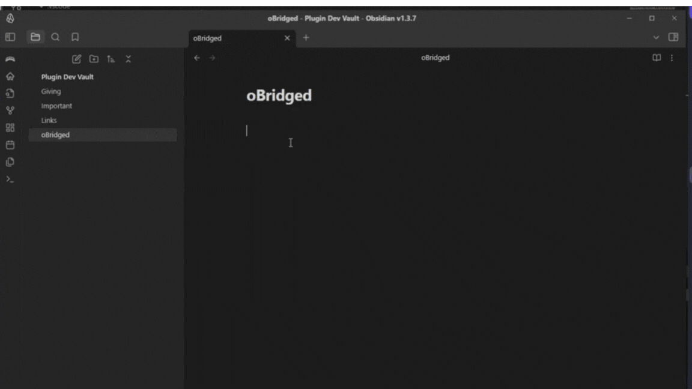
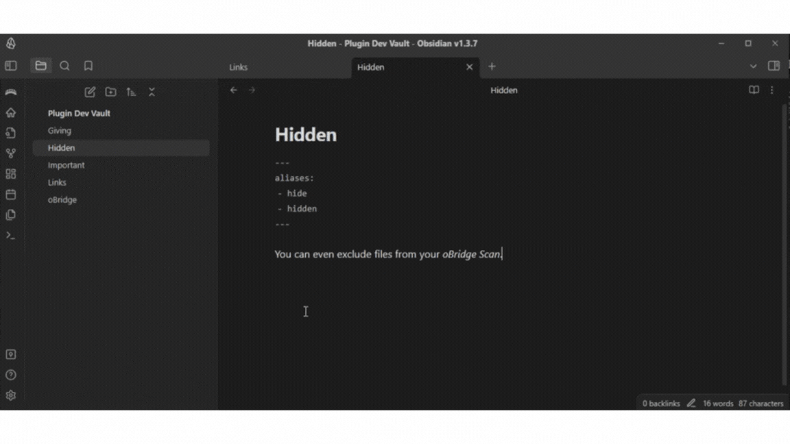

## oBridge - An Obsidian plugin
 
A tool for automatically creating links between notes to bridge them together.

### Features

- **Scan Vault**: Clicking on the bridge icon in the ribbon menu scans your vault, and looks for matches between content and filenames / aliases. If a match is found, a new link in the note is created automatically, and your notes are bridged. 

- **Excluded Files or Folders from oBridge**: Don't want oBridge to link every file or folder? You can exclude files or folder from your *scan* to avoid linking this that you don't want to link.

- **Advanced Options**: You also have even futher control over your excluded files or folders using the **Advanced Options**:
    - Bridge to External Content: Only available in the advanced menu. If enabled, will recognize and create links from the file's aliases.
    - Bridge to Internal Content: Also found in the advanced options, if enabled, will make links in from external content, in the file.

### ⬇️ Installation

You can install this plugin by downloading it from the Obsidian Plugin store, [found here](https://obsidian.md/plugins?id=obridge).

### 📃 Credits

Credit to [AlexW00](https://github.com/AlexW00) for inspiring this with their plugin (obsidian-note-linker)[https://github.com/AlexW00/obsidian-note-linker/tree/master].